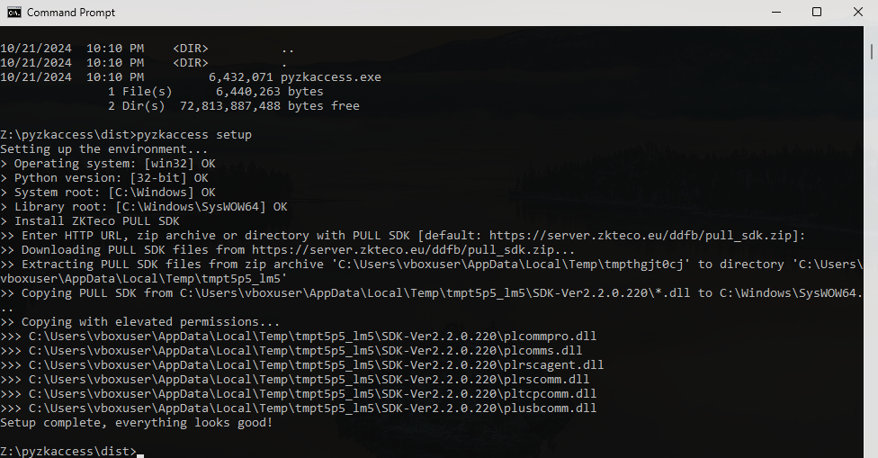

# PyZKAccess

[](https://pypi.org/project/pyzkaccess/)
[](https://pypi.org/project/pyzkaccess/)

[](https://codecov.io/gh/bdragon300/pyzkaccess)
[](https://github.com/bdragon300/pyzkaccess/blob/master/LICENSE)

**PyZKAccess** is a library and command-line interface for working with ZKTeco ZKAccess
C3-100/200/400 access controllers.

This package is Windows-only, but it can be used on *nix systems with [Wine](https://www.winehq.org/).
It built on top of the ZKTeco PULL SDK and fully supports all its features.

This package, once installed, may be used as library for your project or command-line interface.
It's also distributed as a portable Windows executable, created by [PyInstaller](https://pyinstaller.org/en/stable/) with built-in 32-bit Python
interpreter.

[Read documentation](https://bdragon300.github.io/pyzkaccess)

## Features

We support all the features the ZKTeco PULL SDK provides:

- Can be used as a code library or a command-line tool
- Reading and writing the device data tables
- Making queries to device data tables
- CSV format support
- On-board relays control
- Read the realtime events of a particular reader, aux input, door or the whole device
- Manipulation the device parameters such as datetime, network settings, entry modes, backup time, etc.
- Manipulation the door parameters such as smart card modes, intervals, entry modes, etc.
- Restart a device
- Scan the local network for active C3 devices
- Download/upload files from PC to/from a device
- Cancel alarm function
- Reset the device IP address by its MAC address

## Quick start

The quickest way is to use [portable pyzkaccess.exe](https://github.com/bdragon300/pyzkaccess/releases/latest).
It contains the full `pyzkaccess` package with built-in Python and necessary libraries.

*You can also install the package from PyPI (the __32-bit__ Python>=3.8 version is required) `pip install pyzkaccess`*

Run this to setup the environment:

```console
pyzkaccess setup
```

This command will make a quick compatibility check of your system and suggest you to install PULL SDK from the
official ZKTeco site (*you can also specify your own SDK archive or you can install SDK manually, see
[docs](https://bdragon300.github.io/pyzkaccess#installation) for more info*).



All set! Now let's find out what ZKAccess devices are available on the local network:

```console
$ pyzkaccess search_devices
+---------------+-------------------+--------+---------------------+--------------------------+
| ip            | mac               | model  | serial_number       | version                  |
+---------------+-------------------+--------+---------------------+--------------------------+
| 192.168.1.201 | 00:17:61:C3:BA:55 | C3-400 | DGD9190010050345332 | AC Ver 4.3.4 Apr 28 2017 |
+---------------+-------------------+--------+---------------------+--------------------------+
```

Let's enumerate all users registered on a device:

```console
$ pyzkaccess connect 192.168.1.201 table User
+----------+------------+-------+----------+-----+------------+-----------------+
| card     | end_time   | group | password | pin | start_time | super_authorize |
+----------+------------+-------+----------+-----+------------+-----------------+
| 16268812 | 2020-12-01 | 2     | 123456   | 1   | 2020-06-01 | 1               |
| 16268813 |            | 3     | 123451   | 3   |            | 0               |
+----------+------------+-------+----------+-----+------------+-----------------+
```

Or print a particular one:

```console
$ pyzkaccess connect 192.168.1.201 table User where --card=16268812
+----------+------------+-------+----------+-----+------------+-----------------+
| card     | end_time   | group | password | pin | start_time | super_authorize |
+----------+------------+-------+----------+-----+------------+-----------------+
| 16268812 | 2020-12-01 | 2     | 123456   | 1   | 2020-06-01 | 1               |
+----------+------------+-------+----------+-----+------------+-----------------+
```

Adding, updating, or deleting records from a device table:

```console
$ cat users1.csv | pyzkaccess --format=csv connect 192.168.1.201 table User upsert
$ cat users2.csv | pyzkaccess --format=csv connect 192.168.1.201 table User delete
$ pyzkaccess connect 192.168.1.201 table User --card=16268812 delete_all
```

Switching relays and awaiting device events:

```console
$ pyzkaccess connect 192.168.1.201 relays switch_on
$ pyzkaccess connect 192.168.1.201 events --event_type=23 poll
           card door     entry_exit     event_type  pin                     time    verify_mode
       16268813    1              0             23    3      2020-05-09 22:35:55              0
```

Getting and setting parameters:

```console
$ pyzkaccess connect 192.168.1.201 parameters --names=ip_address,serial_number,datetime
+---------------------+---------------+---------------------+
| datetime            | ip_address    | serial_number       |
+---------------------+---------------+---------------------+
| 2020-05-09 22:42:31 | 192.168.1.201 | DGD9190010050345332 |
+---------------------+---------------+---------------------+
$ pyzkaccess connect 192.168.1.201 parameters set --datetime='2020-05-09 22:42:31' --rs232_baud_rate=57600
```
