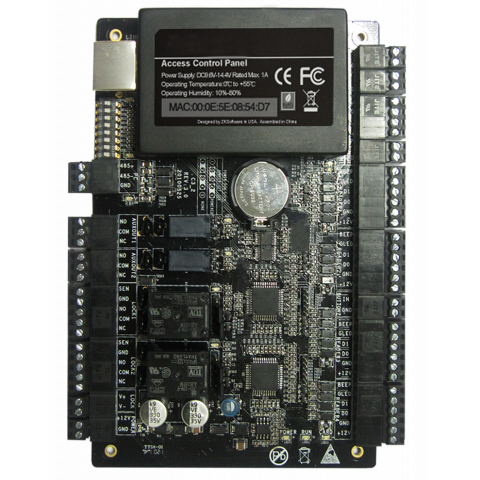
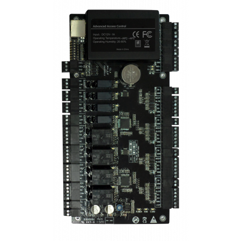

# Summary

The ZKTeco PULL SDK is used as machinery. So the code is intended to be executed in Windows 
environment. *nix are also supported by Wine.

## Features

* Relays switching
* Reading events of whole device or separately for a certain reader, aux input or even door
* Getting/setting device parameters such as datetime, network settings, entry modes, backup 
  time, etc.
* Getting/setting door parameters such as smart card modes, intervals, entry modes, etc.
* Searching for active C3 devices by scanning a local network
* Restarting a device

Here are the controllers we're taking about:

C3-100 | C3-200 | C3-400
------ | ------ | ------
 |  | 

### To be implemented

* Pulling data from a device with filtering support (cards, ACL, holidays and timezone info,
  access history, i/o table)
* Uploading data to a device (the same)
* CLI interface
* Downloading/uploading files from PC to/from a device
* Restoring device settings from SD card backup
* Cancelling alarm function
* Emergency resetting device network settings

**NOTE**: API `pyzkaccess>=0.2` is incompatible with API `pyzkaccess==0.1`.
